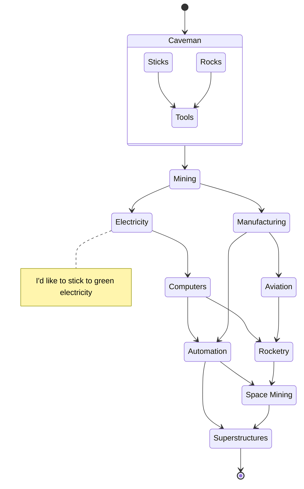

# Stages?
Superstructures in space 
Space mining 
Rocketry 
Aviation 
Automation 
Manufaction 
Tricking rocks to think (Computers) 
Electricity (I'd like to stick to green electricity) 
Mining 
Cave-man (THE START!)

# Flowchart

## Sub-Flowcharts
